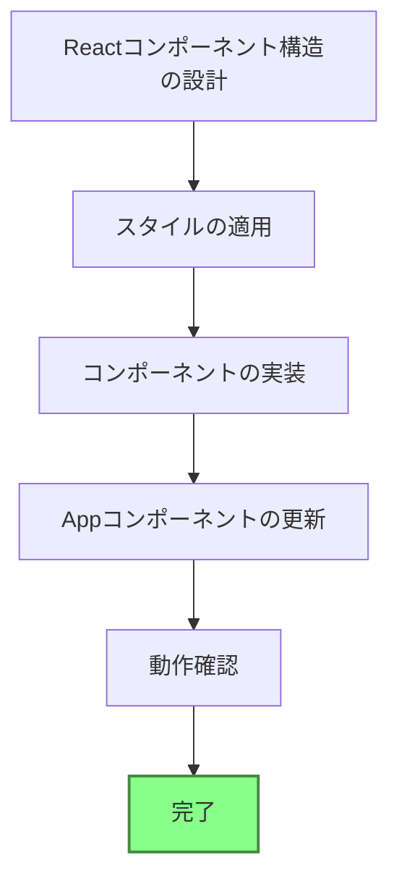
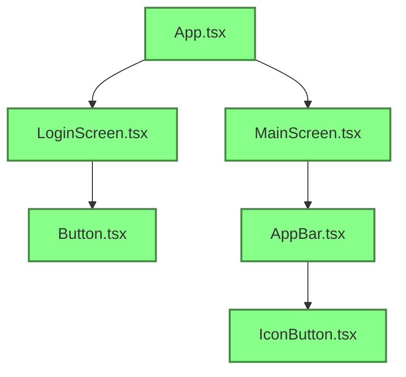

# Current Status

## What Works

- Project setup with Vite and React
- Figma API integration via MCP server
- Figma data retrieval
- SVG icons downloaded from Figma
- Component structure created
- Styling applied based on Figma design
- Navigation between screens implemented
- Application successfully running in development mode

## What's Left to Build

1. Component Structure
   - [x] Create directory structure for components
   - [x] Create Button component
   - [x] Create IconButton component
   - [x] Create AppBar component
   - [x] Create LoginScreen component
   - [x] Create MainScreen component

2. Styling
   - [x] Extract theme information from Figma
   - [x] Create theme.ts file
   - [x] Apply styles to components

3. Integration
   - [x] Update App.tsx to use the new components
   - [x] Implement navigation between screens

4. Future Enhancements
   - [ ] Add more content to the main screen
   - [ ] Implement form validation
   - [ ] Add proper routing if needed
   - [ ] Add more functionality based on user requirements

## Known Issues

- None at this time

## Implementation Plan (Completed)



### Component Structure (Implemented)



### Project Structure

```
figma-mcp-example/
├── src/
│   ├── assets/
│   │   ├── icons/
│   │   │   ├── menu-icon.svg
│   │   │   └── action-icon.svg
│   │   └── react.svg
│   ├── components/
│   │   ├── AppBar.tsx
│   │   ├── Button.tsx
│   │   └── IconButton.tsx
│   ├── screens/
│   │   ├── LoginScreen.tsx
│   │   └── MainScreen.tsx
│   ├── styles/
│   │   └── theme.ts
│   ├── types/
│   │   └── svg.d.ts
│   ├── App.css
│   ├── App.tsx
│   ├── index.css
│   ├── main.tsx
│   └── vite-env.d.ts
```
